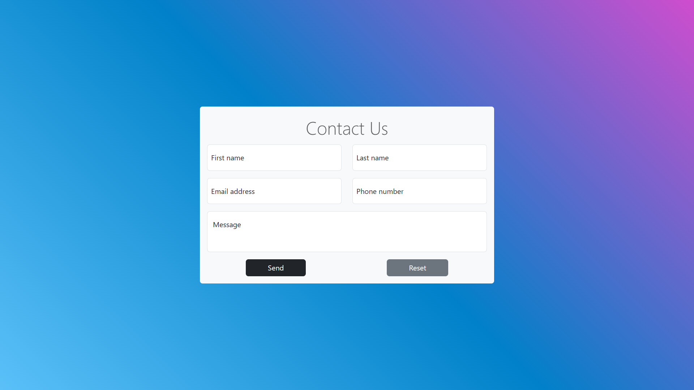

# ContactForm_Javascript




## :information_source: About  

This is a **Front-End** form with client-side validation.

The goal was to work with **Regex** and **client-side validation** before *server validation*.


## :wrench: Tools
- Javascript
- Bootstrap 5.3.0

<!-- 
    SETUP
    Explain using command lines, the steps to follow to setup the project
    At the end show, the expected result with a image   

    Ex: 
    1. Download the whole project `Travel` on your system
    2. Open your terminal in `Travel`
    ```
    cd Travel
    ```
    3. In `Travel` directory, run:
    ```
    go run github.com/loickcherimont/Travel/main
    ```
    4. If there is no error. Go on your favorite browser and use this line in your URL address bar
    ```
    http://localhost:8080/travel
    ```
    5. Here you are! Welcome in the main page of the Web application

    
-->

## :inbox_tray: Setup for contributions
1. Clone the project
```bash
git clone git@github:loickcherimont/ContactForm_Javascript.git
cd ContactForm_Javascript
```
2. Run it and here you are in the main page of the app.
> :warning: Take a look at ```Prerequisites``` before continue!


## :warning: Prerequisites

You need a ```web server``` to run this app locally on your laptop


## :thinking: How does it run ?

Fill the differents fields.  

If your input is invalid (wrong value or null) by different manners Javascript returns an error message.


## :test_tube: Features
- Add more specific validation for each field
- Develop the back-end side with Golang 
 
## :key: License

Developed by Loick Cherimont  

Under MIT License  

Last edited on: 2024-07-31
